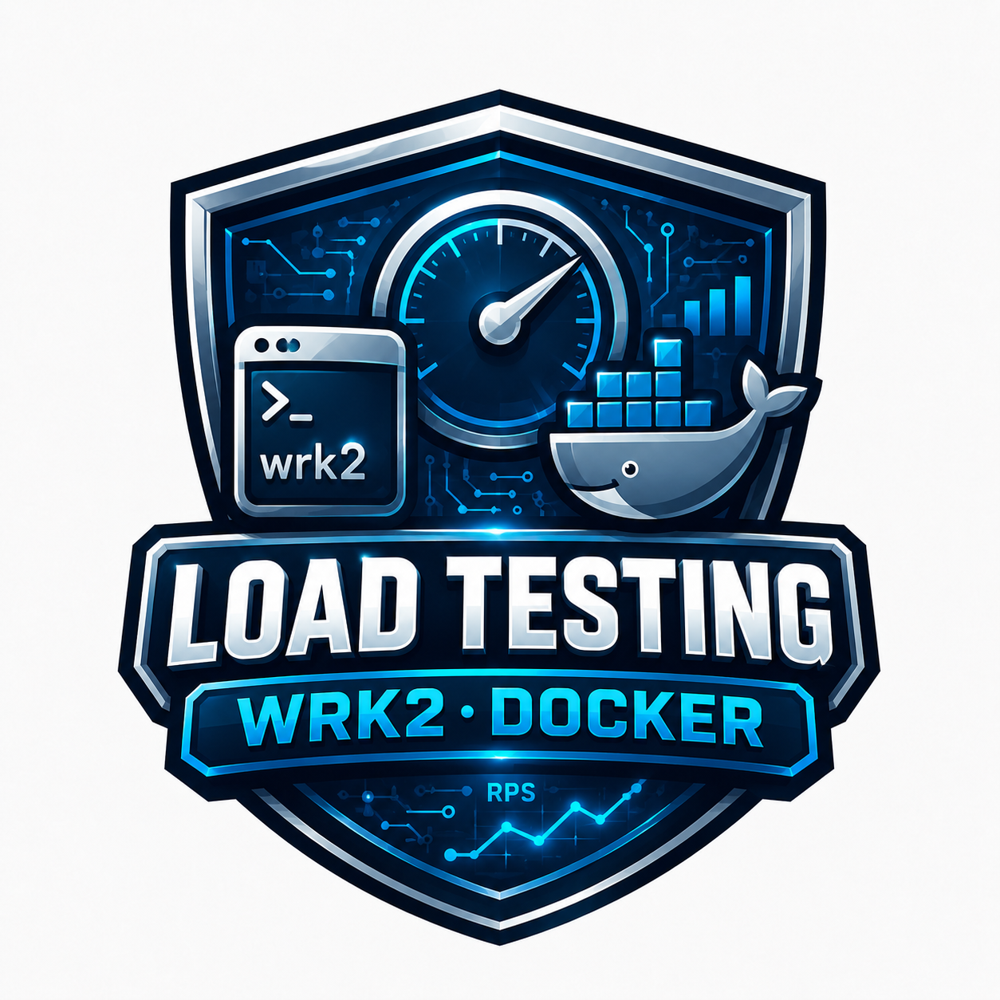

<p align="center">

</p>

HTTP benchmarking tool.

## 🚀 Usage

```bash
docker run --rm rizort/wrk2 --latency -R 300 https://site.com
```

## 💡 Develop

Creating new Docker image and upload it to DockerHub. 

1. `make build`
2. `make push`